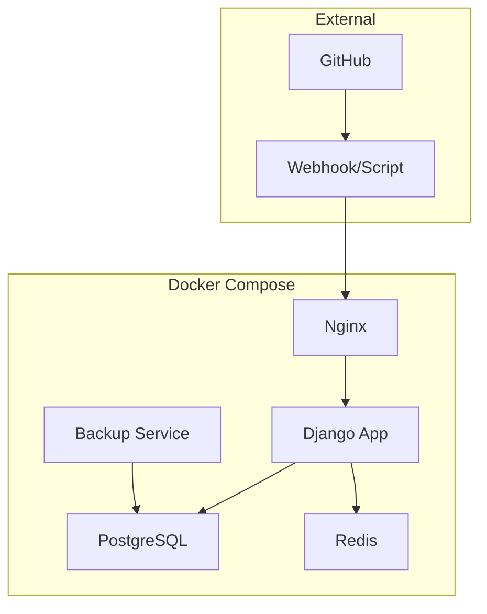

# Design Document - Dockerización y Despliegue a Producción

## Overview

El diseño implementa una arquitectura de microservicios usando Docker Compose con servicios separados para la aplicación Django, PostgreSQL, Redis y Nginx. Se incluye un sistema de actualización automática desde GitHub con backups y rollbacks automáticos.

## Architecture

### Servicios Docker



### Componentes Principales

1. **Django Application Container**
   - Imagen base: Python 3.11-slim
   - Gunicorn como WSGI server
   - Todas las dependencias del proyecto
   - Variables de entorno para configuración

2. **PostgreSQL Database**
   - Imagen oficial PostgreSQL 15
   - Volúmenes persistentes para datos
   - Configuración optimizada para producción
   - Backups automáticos programados

3. **Redis Cache**
   - Imagen oficial Redis 7
   - Configuración para cache y sesiones
   - Persistencia opcional

4. **Nginx Reverse Proxy**
   - Imagen oficial Nginx Alpine
   - SSL/TLS termination
   - Servir archivos estáticos
   - Rate limiting y seguridad

## Components and Interfaces

### Dockerfile para Django

```dockerfile
FROM python:3.11-slim

# Instalar dependencias del sistema
RUN apt-get update && apt-get install -y \
    postgresql-client \
    gettext \
    && rm -rf /var/lib/apt/lists/*

# Configurar directorio de trabajo
WORKDIR /app

# Copiar requirements e instalar dependencias Python
COPY requirements.txt .
RUN pip install --no-cache-dir -r requirements.txt

# Copiar código de la aplicación
COPY . .

# Crear usuario no-root
RUN useradd --create-home --shell /bin/bash app \
    && chown -R app:app /app
USER app

# Exponer puerto
EXPOSE 8000

# Comando por defecto
CMD ["gunicorn", "--bind", "0.0.0.0:8000", "config.wsgi:application"]
```

### Docker Compose Structure

```yaml
version: '3.8'

services:
  web:
    build: .
    environment:
      - DJANGO_SETTINGS_MODULE=config.settings.production
    volumes:
      - ./media:/app/media
      - ./staticfiles:/app/staticfiles
    depends_on:
      - db
      - redis

  db:
    image: postgres:15
    environment:
      - POSTGRES_DB=certificados_prod
      - POSTGRES_USER=certificados_user
      - POSTGRES_PASSWORD=${DB_PASSWORD}
    volumes:
      - postgres_data:/var/lib/postgresql/data

  redis:
    image: redis:7-alpine
    volumes:
      - redis_data:/data

  nginx:
    image: nginx:alpine
    ports:
      - "80:80"
      - "443:443"
    volumes:
      - ./nginx.conf:/etc/nginx/nginx.conf
      - ./staticfiles:/app/staticfiles
      - ./media:/app/media
    depends_on:
      - web
```

### Sistema de Actualización Automática

#### Opción 1: Script de Actualización Manual
```bash
#!/bin/bash
# update-production.sh

# 1. Crear backup
docker-compose exec db pg_dump -U certificados_user certificados_prod > backup_$(date +%Y%m%d_%H%M%S).sql

# 2. Actualizar código
git pull origin main

# 3. Reconstruir y reiniciar servicios
docker-compose down
docker-compose up -d --build

# 4. Ejecutar migraciones
docker-compose exec web python manage.py migrate
docker-compose exec web python manage.py collectstatic --noinput
```

#### Opción 2: Webhook Automático
```python
# webhook_server.py
from flask import Flask, request
import subprocess
import hmac
import hashlib

app = Flask(__name__)

@app.route('/webhook', methods=['POST'])
def webhook():
    if verify_github_signature(request):
        subprocess.run(['./update-production.sh'])
        return 'OK', 200
    return 'Unauthorized', 401
```

#### Opción 3: GitHub Actions CI/CD
```yaml
# .github/workflows/deploy.yml
name: Deploy to Production

on:
  push:
    branches: [main]

jobs:
  deploy:
    runs-on: ubuntu-latest
    steps:
      - name: Deploy to server
        uses: appleboy/ssh-action@v0.1.5
        with:
          host: ${{ secrets.HOST }}
          username: ${{ secrets.USERNAME }}
          key: ${{ secrets.SSH_KEY }}
          script: |
            cd /app
            ./update-production.sh
```

## Data Models

### Variables de Entorno de Producción

```bash
# .env.production
DJANGO_SETTINGS_MODULE=config.settings.production
DEBUG=False
SECRET_KEY=production_secret_key
ALLOWED_HOSTS=tu-dominio.com,www.tu-dominio.com

# Database
DB_NAME=certificados_prod
DB_USER=certificados_user
DB_PASSWORD=secure_password
DB_HOST=db
DB_PORT=5432

# Redis
REDIS_URL=redis://redis:6379/0

# Email
EMAIL_HOST=smtp.gmail.com
EMAIL_PORT=587
EMAIL_USE_TLS=True
EMAIL_HOST_USER=tu-email@gmail.com
EMAIL_HOST_PASSWORD=tu_app_password
```

### Configuración de Nginx

```nginx
server {
    listen 80;
    server_name tu-dominio.com;
    return 301 https://$server_name$request_uri;
}

server {
    listen 443 ssl http2;
    server_name tu-dominio.com;
    
    ssl_certificate /etc/nginx/ssl/cert.pem;
    ssl_certificate_key /etc/nginx/ssl/key.pem;
    
    location / {
        proxy_pass http://web:8000;
        proxy_set_header Host $host;
        proxy_set_header X-Real-IP $remote_addr;
        proxy_set_header X-Forwarded-For $proxy_add_x_forwarded_for;
        proxy_set_header X-Forwarded-Proto $scheme;
    }
    
    location /static/ {
        alias /app/staticfiles/;
        expires 1y;
        add_header Cache-Control "public, immutable";
    }
    
    location /media/ {
        alias /app/media/;
        expires 1y;
        add_header Cache-Control "public";
    }
}
```

## Error Handling

### Estrategias de Rollback

1. **Rollback Automático**: Si los health checks fallan después de una actualización
2. **Rollback Manual**: Comando para volver a la versión anterior
3. **Backup de Base de Datos**: Restauración automática en caso de error crítico

### Monitoreo y Alertas

1. **Health Checks**: Endpoints para verificar estado de servicios
2. **Logs Centralizados**: Agregación de logs de todos los contenedores
3. **Métricas**: CPU, memoria, requests por segundo
4. **Alertas**: Notificaciones por email/Slack en caso de errores

## Testing Strategy

### Testing de Contenedores

1. **Build Testing**: Verificar que las imágenes se construyen correctamente
2. **Integration Testing**: Probar comunicación entre servicios
3. **Performance Testing**: Verificar rendimiento bajo carga
4. **Security Testing**: Escaneo de vulnerabilidades en imágenes

### Testing de Despliegue

1. **Staging Environment**: Entorno idéntico a producción para pruebas
2. **Blue-Green Deployment**: Despliegue sin downtime
3. **Canary Releases**: Despliegue gradual para validar cambios
4. **Rollback Testing**: Verificar que los rollbacks funcionan correctamente

### Automatización de Pruebas

```bash
# test-deployment.sh
#!/bin/bash

# Ejecutar tests antes del despliegue
docker-compose -f docker-compose.test.yml run --rm web python manage.py test

# Verificar que los servicios inician correctamente
docker-compose up -d
sleep 30

# Health checks
curl -f http://localhost/health/ || exit 1

# Tests de integración
docker-compose exec web python manage.py test certificates.tests.test_integration

echo "✅ Despliegue validado correctamente"
```