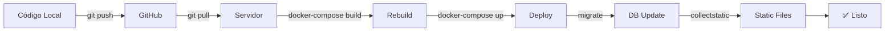

# 🚀 Resumen Ejecutivo - Despliegue Remoto

## ⚡ Inicio Rápido (5 Pasos)

### 1️⃣ Subir a GitHub (Local - Windows)

```cmd
SUBIR_A_GITHUB_AHORA.bat
```

### 2️⃣ Conectar al Servidor

```bash
ssh usuario@IP_DEL_SERVIDOR
```

### 3️⃣ Instalar Docker (Primera vez)

```bash
curl -fsSL https://get.docker.com | sudo sh
sudo usermod -aG docker $USER
exit
# Volver a conectar
ssh usuario@IP_DEL_SERVIDOR
```

### 4️⃣ Clonar y Configurar

```bash
git clone https://github.com/TU_USUARIO/TU_REPO.git
cd TU_REPO
cp .env.production.example .env.production
nano .env.production  # Configurar variables
```

### 5️⃣ Desplegar

```bash
chmod +x deploy-ubuntu.sh
./deploy-ubuntu.sh
```

---

## 📋 Archivos Creados

### Documentación
- ✅ **GUIA_DESPLIEGUE_REMOTO.md** - Guía completa paso a paso
- ✅ **COMANDOS_DESPLIEGUE_REMOTO.md** - Referencia rápida de comandos
- ✅ **DESPLIEGUE_REMOTO_RESUMEN.md** - Este archivo (resumen ejecutivo)

### Scripts
- ✅ **SUBIR_A_GITHUB_AHORA.bat** - Script para subir código a GitHub (Windows)
- ✅ **deploy-ubuntu.sh** - Script de despliegue automatizado (Ubuntu)

---

## 🌐 URLs de Acceso

Después del despliegue, accede a:

| Servicio | URL |
|----------|-----|
| **Página Principal** | http://IP_DEL_SERVIDOR/ |
| **Admin** | http://IP_DEL_SERVIDOR/admin/ |
| **Dashboard** | http://IP_DEL_SERVIDOR/admin/dashboard/ |
| **Consulta** | http://IP_DEL_SERVIDOR/consulta/ |
| **Health Check** | http://IP_DEL_SERVIDOR/health/ |

**Credenciales por defecto:**
- Usuario: `admin`
- Contraseña: `admin123`

⚠️ **IMPORTANTE:** Cambia la contraseña inmediatamente:
```bash
docker-compose exec web python manage.py changepassword admin
```

---

## 🔧 Comandos Esenciales

### Ver Estado

```bash
docker-compose ps
docker-compose logs -f
```

### Actualizar Aplicación

```bash
git pull origin main
docker-compose build
docker-compose up -d
docker-compose exec web python manage.py migrate
docker-compose exec web python manage.py collectstatic --noinput
```

### Reiniciar Servicios

```bash
docker-compose restart
```

### Backup

```bash
docker-compose exec postgres pg_dump -U certificados_user certificados_db > backup_$(date +%Y%m%d).sql
```

---

## 🎯 Checklist de Despliegue

### Pre-Despliegue (Local)
- [ ] Código probado localmente
- [ ] Tests pasando
- [ ] Variables de entorno configuradas
- [ ] Código subido a GitHub

### Servidor
- [ ] Docker instalado
- [ ] Docker Compose instalado
- [ ] Repositorio clonado
- [ ] .env.production configurado
- [ ] Scripts con permisos de ejecución

### Post-Despliegue
- [ ] Contenedores corriendo
- [ ] Base de datos funcionando
- [ ] Archivos estáticos cargando
- [ ] Admin accesible
- [ ] Contraseña de admin cambiada
- [ ] SSL configurado (si aplica)
- [ ] Backups configurados

---

## 🔐 Configuración SSL (Opcional)

Si tienes un dominio:

```bash
# Instalar certbot
sudo apt install certbot python3-certbot-nginx -y

# Generar certificado
sudo certbot --nginx -d tu-dominio.com -d www.tu-dominio.com

# Verificar renovación automática
sudo certbot renew --dry-run
```

---

## 🐛 Troubleshooting Rápido

### Contenedores no inician
```bash
docker-compose logs
docker-compose down
docker-compose up -d
```

### Error de base de datos
```bash
docker-compose logs postgres
docker-compose exec web python manage.py migrate
```

### Archivos estáticos no cargan
```bash
docker-compose exec web python manage.py collectstatic --noinput
docker-compose restart nginx
```

### Puerto ocupado
```bash
sudo lsof -i :80
sudo systemctl stop apache2  # Si Apache está instalado
```

---

## 📊 Monitoreo

### Ver Recursos

```bash
docker stats
df -h
free -h
```

### Health Checks

```bash
curl http://localhost/health/
docker-compose exec web python manage.py check --database default
docker-compose exec redis redis-cli ping
```

---

## 🔄 Flujo de Actualización



---

## 📚 Documentación Completa

Para más detalles, consulta:

1. **GUIA_DESPLIEGUE_REMOTO.md** - Guía paso a paso completa
2. **COMANDOS_DESPLIEGUE_REMOTO.md** - Todos los comandos disponibles
3. **GUIA_DESPLIEGUE_PRODUCCION_2025.md** - Configuración avanzada
4. **docs/PRODUCTION_DEPLOYMENT.md** - Documentación técnica

---

## 💡 Tips Importantes

1. **Siempre haz backup** antes de actualizar
2. **Prueba localmente** antes de desplegar
3. **Revisa los logs** después de cada despliegue
4. **Cambia las contraseñas** por defecto
5. **Configura SSL** si tienes dominio
6. **Monitorea recursos** regularmente
7. **Documenta cambios** importantes

---

## 🆘 Soporte

Si encuentras problemas:

1. Revisa los logs: `docker-compose logs`
2. Consulta **COMANDOS_DESPLIEGUE_REMOTO.md**
3. Revisa la sección Troubleshooting en **GUIA_DESPLIEGUE_REMOTO.md**
4. Verifica que todas las variables de entorno estén configuradas

---

## ✅ Resultado Esperado

Después de completar el despliegue:

- ✅ Aplicación corriendo en el servidor
- ✅ Base de datos PostgreSQL funcionando
- ✅ Redis para caché operativo
- ✅ Nginx sirviendo la aplicación
- ✅ Admin accesible
- ✅ Archivos estáticos cargando
- ✅ Sistema listo para producción

---

## 🎉 ¡Listo!

Tu sistema de certificados está desplegado y listo para usar.

**Próximos pasos:**
1. Cambiar contraseña de admin
2. Configurar SSL (si tienes dominio)
3. Configurar backups automáticos
4. Configurar monitoreo
5. Importar datos reales

---

**Tiempo estimado total:** 30-45 minutos (primera vez)

**Actualizaciones posteriores:** 5-10 minutos

---

¡Buena suerte con tu despliegue! 🚀
