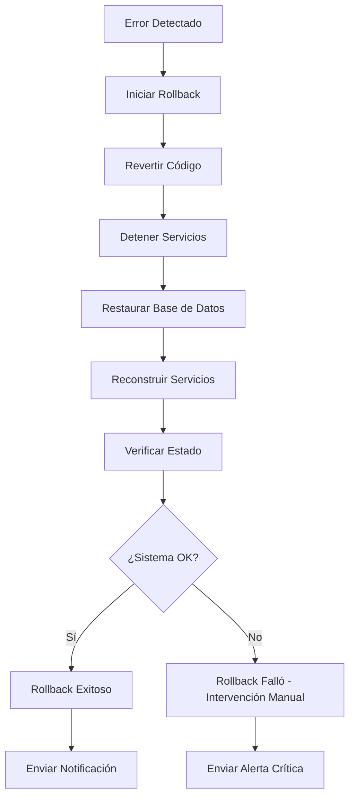

# Sistema de Rollback Automático

## Descripción General

El sistema de rollback automático proporciona una capa de seguridad para los despliegues en producción, permitiendo revertir automáticamente cambios fallidos y restaurar el sistema a un estado funcional anterior.

## Características Principales

### 1. Detección Automática de Errores

El sistema detecta automáticamente errores en las siguientes etapas:

- **Actualización de código**: Errores al hacer pull desde GitHub
- **Construcción de servicios**: Fallos al construir imágenes Docker
- **Migraciones de base de datos**: Errores al aplicar migraciones
- **Recopilación de estáticos**: Fallos al recopilar archivos estáticos
- **Health checks**: Servicios que no responden correctamente
- **Verificación de integridad**: Problemas en la configuración de la aplicación

### 2. Rollback Automático

Cuando se detecta un error, el sistema automáticamente:

1. **Revierte el código** al commit anterior
2. **Restaura la base de datos** desde el backup creado antes del despliegue
3. **Reconstruye los servicios** con la versión anterior
4. **Verifica el estado** del sistema después del rollback
5. **Envía notificaciones** sobre el estado del rollback

### 3. Backups Automáticos

Antes de cada despliegue:

- Se crea un backup completo de la base de datos PostgreSQL
- Los backups se comprimen automáticamente con gzip
- Se mantienen los últimos 7 días de backups
- Los backups antiguos se eliminan automáticamente

### 4. Notificaciones

El sistema puede enviar notificaciones a través de:

- **Logs estructurados**: Archivo `logs/notifications.log`
- **Slack**: Mediante webhook (configurable)
- **Email**: Mediante comando `mail` (configurable)
- **Webhook personalizado**: Para integraciones custom

## Configuración

### Variables de Entorno

Agregue estas variables a su archivo `.env.production`:

```bash
# Configuración de Rollback
ROLLBACK_ENABLED=true
AUTO_ROLLBACK=true
HEALTH_CHECK_RETRIES=3
HEALTH_CHECK_DELAY=10

# Notificaciones (opcional)
SLACK_WEBHOOK_URL=https://hooks.slack.com/services/YOUR/WEBHOOK/URL
NOTIFICATION_EMAIL=admin@example.com
WEBHOOK_URL=https://your-webhook-endpoint.com/notify
```

### Configuración en el Script

Edite las variables al inicio de `update-production.sh`:

```bash
# Configuración
APP_DIR="/app"
BACKUP_DIR="$APP_DIR/backups"
LOG_FILE="$APP_DIR/logs/update.log"
COMPOSE_FILE="docker-compose.prod.yml"
MAX_BACKUPS=7
ROLLBACK_ENABLED=true
AUTO_ROLLBACK=true
HEALTH_CHECK_RETRIES=3
HEALTH_CHECK_DELAY=10
```

## Uso

### Despliegue Automático con Rollback

El rollback automático está integrado en el script de actualización:

```bash
# Linux/Mac
./update-production.sh

# Windows
update-production.bat
```

Si ocurre un error durante el despliegue, el sistema automáticamente:
1. Detecta el error
2. Inicia el rollback
3. Restaura el sistema
4. Envía notificaciones

### Rollback Manual

Para realizar un rollback manual, use el script dedicado:

#### Linux/Mac

```bash
# Menú interactivo
./rollback.sh

# Rollback rápido (último commit + último backup)
./rollback.sh --quick

# Rollback a commit específico
./rollback.sh --commit abc123

# Restaurar backup específico
./rollback.sh --backup backups/backup_20250109_120000.sql.gz

# Rollback completo
./rollback.sh --full abc123 backups/backup_20250109_120000.sql.gz

# Verificar estado
./rollback.sh --status
```

#### Windows

```batch
REM Menú interactivo
rollback.bat
```

### Opciones del Menú Interactivo

1. **Ver commits recientes**: Lista los últimos 10 commits
2. **Ver backups disponibles**: Muestra todos los backups en el directorio
3. **Rollback a commit específico**: Revierte el código a un commit específico
4. **Restaurar backup de base de datos**: Restaura solo la base de datos
5. **Rollback completo**: Revierte código y base de datos
6. **Verificar estado del sistema**: Comprueba que todos los servicios funcionen
7. **Rollback rápido**: Revierte al commit y backup más recientes

## Proceso de Rollback

### Rollback Automático



### Pasos Detallados

1. **Detección de Error**
   - El script detecta un error en cualquier etapa del despliegue
   - Se registra el error en los logs
   - Se activa el proceso de rollback

2. **Revertir Código**
   - Se identifica el commit anterior (guardado antes del despliegue)
   - Se ejecuta `git reset --hard` al commit anterior
   - Se verifica que el código se haya revertido correctamente

3. **Detener Servicios**
   - Se detienen todos los contenedores Docker
   - Se asegura que no haya procesos en ejecución

4. **Restaurar Base de Datos**
   - Se inicia solo el servicio de base de datos
   - Se restaura el backup creado antes del despliegue
   - Se verifica la integridad de la restauración

5. **Reconstruir Servicios**
   - Se reconstruyen las imágenes Docker con el código anterior
   - Se inician todos los servicios
   - Se ejecutan las migraciones necesarias

6. **Verificar Estado**
   - Se ejecutan health checks en todos los servicios
   - Se verifica la integridad de la aplicación
   - Se comprueban los logs en busca de errores

7. **Notificación**
   - Se envían notificaciones del resultado del rollback
   - Se registra todo el proceso en los logs

## Health Checks

### Verificaciones de Servicios

El sistema verifica:

- **Servicios Docker**: Todos los contenedores deben estar "Up"
- **Endpoint de salud**: `/health/` debe responder con código 200
- **Configuración Django**: Settings deben cargarse correctamente
- **Conexión a BD**: La aplicación debe conectarse a PostgreSQL
- **Logs de aplicación**: No deben contener errores críticos

### Configuración de Health Checks

```bash
# Número de reintentos
HEALTH_CHECK_RETRIES=3

# Tiempo de espera entre reintentos (segundos)
HEALTH_CHECK_DELAY=10
```

## Backups

### Ubicación

Los backups se almacenan en:
```
/app/backups/
├── backup_20250109_120000.sql.gz
├── backup_20250109_140000.sql.gz
└── safety_backup_20250109_150000.sql.gz
```

### Formato de Nombres

```
backup_YYYYMMDD_HHMMSS.sql.gz
```

### Retención

- Se mantienen los últimos **7 días** de backups
- Los backups más antiguos se eliminan automáticamente
- Los backups de seguridad (creados durante rollbacks) se mantienen indefinidamente

### Restauración Manual

```bash
# Descomprimir backup
gunzip backups/backup_20250109_120000.sql.gz

# Restaurar en base de datos
docker-compose -f docker-compose.prod.yml exec -T db \
  psql -U certificados_user certificados_prod < backups/backup_20250109_120000.sql
```

## Logs

### Archivos de Log

- **update.log**: Log del proceso de actualización
- **rollback.log**: Log del proceso de rollback
- **notifications.log**: Log de todas las notificaciones enviadas

### Ubicación

```
/app/logs/
├── update.log
├── rollback.log
└── notifications.log
```

### Formato de Logs

```
[2025-01-09 12:00:00] STEP: Iniciando proceso de actualización
[2025-01-09 12:00:05] SUCCESS: Prerrequisitos verificados
[2025-01-09 12:00:10] ERROR: Health check falló
[2025-01-09 12:00:15] ROLLBACK: Health check falló después de la actualización
[2025-01-09 12:01:00] SUCCESS: Rollback completado exitosamente
```

## Notificaciones

### Tipos de Notificaciones

- **INFO**: Inicio de proceso de actualización
- **SUCCESS**: Actualización completada exitosamente
- **WARNING**: Actualización con advertencias
- **ERROR**: Error durante la actualización
- **ROLLBACK_SUCCESS**: Rollback completado exitosamente
- **ROLLBACK_FAILED**: Rollback falló - requiere intervención manual

### Integración con Slack

Agregue el webhook de Slack a `.env.production`:

```bash
SLACK_WEBHOOK_URL=https://hooks.slack.com/services/YOUR/WEBHOOK/URL
```

Las notificaciones incluirán:
- Estado del despliegue (color: verde/amarillo/rojo)
- Mensaje descriptivo
- Timestamp
- Commit hash (si aplica)

### Integración con Email

Instale el comando `mail` y configure:

```bash
NOTIFICATION_EMAIL=admin@example.com
```

## Troubleshooting

### Rollback Automático Falló

Si el rollback automático falla:

1. **Revisar logs**:
   ```bash
   tail -f logs/rollback.log
   ```

2. **Verificar estado de servicios**:
   ```bash
   docker-compose -f docker-compose.prod.yml ps
   ```

3. **Ejecutar rollback manual**:
   ```bash
   ./rollback.sh --quick
   ```

4. **Restaurar backup manualmente** si es necesario

### Base de Datos No Se Restaura

1. **Verificar que el backup existe**:
   ```bash
   ls -lh backups/
   ```

2. **Verificar integridad del backup**:
   ```bash
   gunzip -t backups/backup_20250109_120000.sql.gz
   ```

3. **Restaurar manualmente**:
   ```bash
   gunzip -c backups/backup_20250109_120000.sql.gz | \
     docker-compose -f docker-compose.prod.yml exec -T db \
     psql -U certificados_user certificados_prod
   ```

### Servicios No Inician Después del Rollback

1. **Revisar logs de Docker**:
   ```bash
   docker-compose -f docker-compose.prod.yml logs
   ```

2. **Reconstruir imágenes**:
   ```bash
   docker-compose -f docker-compose.prod.yml build --no-cache
   docker-compose -f docker-compose.prod.yml up -d
   ```

3. **Verificar configuración**:
   ```bash
   docker-compose -f docker-compose.prod.yml config
   ```

## Mejores Prácticas

1. **Siempre probar en staging** antes de desplegar a producción
2. **Verificar backups regularmente** para asegurar que son válidos
3. **Monitorear notificaciones** para detectar problemas rápidamente
4. **Mantener logs organizados** para facilitar troubleshooting
5. **Documentar cambios críticos** que puedan requerir rollback manual
6. **Realizar rollbacks de prueba** periódicamente para verificar el sistema
7. **Mantener múltiples backups** para tener opciones de restauración

## Seguridad

- Los backups contienen datos sensibles - asegúrese de protegerlos
- Use permisos restrictivos en archivos de backup (600)
- Considere encriptar backups para almacenamiento a largo plazo
- No incluya backups en el repositorio Git
- Implemente rotación de backups a almacenamiento externo

## Mantenimiento

### Limpieza de Backups Antiguos

Los backups se limpian automáticamente, pero puede hacerlo manualmente:

```bash
# Eliminar backups más antiguos de 7 días
find backups/ -name "backup_*.sql.gz" -mtime +7 -delete
```

### Verificación de Integridad

Ejecute periódicamente:

```bash
# Verificar que el sistema de rollback funciona
./rollback.sh --status

# Probar rollback en ambiente de staging
./rollback.sh --quick  # en staging
```

### Actualización del Sistema

Para actualizar el sistema de rollback:

1. Hacer backup del script actual
2. Actualizar el script
3. Probar en staging
4. Desplegar a producción

## Referencias

- [Docker Compose Documentation](https://docs.docker.com/compose/)
- [PostgreSQL Backup and Restore](https://www.postgresql.org/docs/current/backup.html)
- [Git Reset Documentation](https://git-scm.com/docs/git-reset)
- [Slack Incoming Webhooks](https://api.slack.com/messaging/webhooks)
